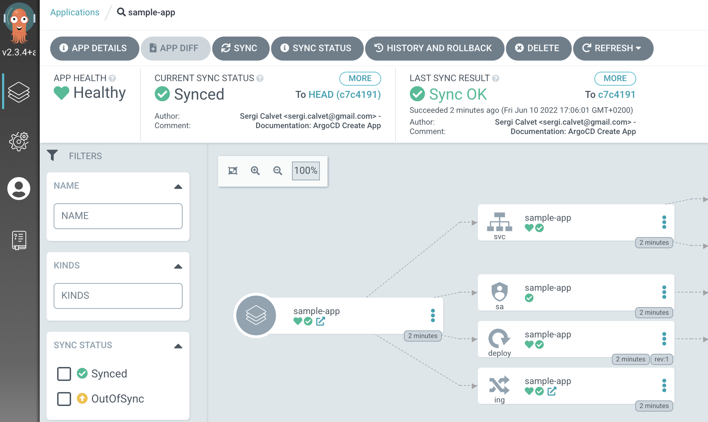

# Configure Sample Application in ArgoCD

## Initial setup

See official documentation [here](https://argo-cd.readthedocs.io/en/stable/getting_started/#6-create-an-application-from-a-git-repository)

To use the CLI you must log in
```shell
argocd login argocd.localtest.me 
```

Init variables
```shell
export GIT_REPOSITORY="https://github.com/scalvetr/poc-argocd.git";
export GITHUB_TOKEN="`cat credentials.json | jq -r '.git.token'`";
export TARGET_NAMESPACE="sample-app"
echo "${GITHUB_TOKEN}"
```

## Create the git Repo

```shell
# cli 
argocd repo add ${GIT_REPOSITORY} \                                                    
--username "not-used" \
--password ${GITHUB_TOKEN} \
--insecure-skip-server-verification

# same thing with kubectl
cat <<EOF | kubectl apply -f -
apiVersion: v1
kind: Secret
metadata:
  name: sample-app-repo
  namespace: argocd
  labels:
    argocd.argoproj.io/secret-type: repository
stringData:
  url: ${GIT_REPOSITORY}
  password: ${GITHUB_TOKEN}
  username: not-used
EOF
```
Verify everything is working


## Create the application
```shell

# same thing with kubectl
cat <<EOF | kubectl apply -f -
apiVersion: v1
kind: Namespace
metadata:
  name: ${TARGET_NAMESPACE}
EOF


# cli 
argocd app create sample-app \
--repo ${GIT_REPOSITORY} \
--path sample-app-helm  \
--dest-server https://kubernetes.default.svc \
--dest-namespace ${TARGET_NAMESPACE} \
--sync-policy auto \
--project default

# same thing with kubectl
cat <<EOF | kubectl apply -f -
apiVersion: argoproj.io/v1alpha1
kind: Application
metadata:
  name: sample-app
  namespace: argocd
spec:
  project: default
  destination:
    namespace: ${TARGET_NAMESPACE}
    server: https://kubernetes.default.svc
  source:
    path: sample-app-helm
    repoURL: ${GIT_REPOSITORY}
  syncPolicy:
    automated: {}
EOF

```
Verify application is working

```shell
curl -vv http://sample-app.localtest.me/echo
# {"method":"GET","path":"/echo"}
```


